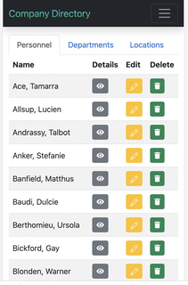

# Company Directory

Employee Management System

## Description
This application is envisaged as a “mobile first“ website that will operate equally well on desktop computers. This is a simple Employee Management System built using HTML, CSS, JavaScript, and jQuery. It allows users to view, add, edit, and delete employee records, departments, and locations.

## Usage

Navigate to the homepage of the Employee Management System.
Use the navigation menu to access different sections:
Employees: View, add, edit, and delete employee records.
Departments: View, add, edit, and delete department records.
Locations: View, add, edit, and delete location records.
Perform actions such as searching, editing, adding, or deleting records as needed.
Interact with modals to add or edit employee, department, or location details.
Confirm deletions through confirmation modals before proceeding.

*** Features ***
- View All Employees: Retrieve and display all employee records from the database.
- Search Employees: Search for employees based on department, location, or search term.
- View Employee Details: View detailed information about a specific employee.
- Edit Employee Details: Edit and update employee details.
- Delete Employee: Delete an employee record from the database.
- View All Departments: Retrieve and display all department records.
- Add Department: Add a new department to the system.
- Edit Department: Edit and update department details.
- Delete Department: Delete a department record.
- View All Locations: Retrieve and display all location records.
- Add Location: Add a new location to the system.
- Edit Location: Edit and update location details.
- Delete Location: Delete a location record.

### Technologies used
* HTML
* CSS
* Bootstrap
* JavaScript
* jQuery
* PHP
* MySQL

## Screenshots

#### Deployed site: https://companydirectory.anara-berdalieva.co.uk/

## License

 MIT License 

## Acknowledgments

The IT Career Switch Traineeship program designated the Company Directory Challenge project as the final assignment for trainees.

## Credits
Developed by Aygerim Berdalieva

If you have any questions or feedback, please don't hesitate to contact [Aygerim](https://www.linkedin.com/in/aygerim-berdalieva/).

